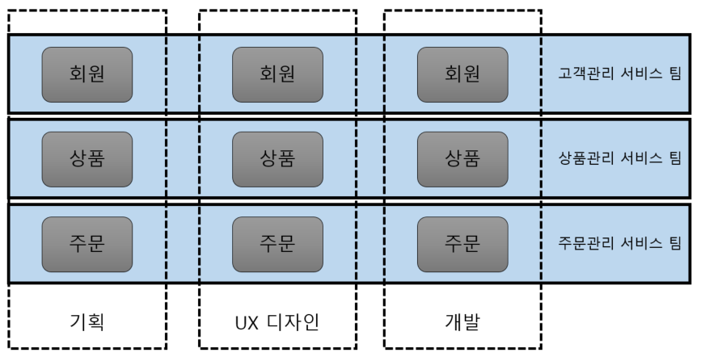

MSA를 공부하기로 했습니다.

## 설명

### 모놀리식

#### 모놀리식 이란

<p align="center">
    
</p>

- 모놀리식 아키텍쳐란, 마이크로서비스 아키텍쳐의 반대 되는 개념으로 전통의 아키텍쳐를 지칭하는 의미로 생겨난 단어입니다. 하나의 서비스 또는 애플리케이션이 하나의 거대한 아키텍쳐를 모놀리식(Monolithic)하다고 합니다.

#### 장점

1. 개발 초기에 단순한 아키텍쳐 구조와 개발에 용이합니다.
1. 어떤 서비스든지 개발되어있는 환경이 같아서 복잡하지 않습니다.
1. 쉽게 고가용성 서버 환경을 만들 수 있습니다.
1. End-to-End 테스트가 용이합니다.

#### 단점

1. 프로젝트의 규모가 커짐에 따라 애플리케이션 구동시간이 늘어나고 빌드, 배포 시간도 길어집니다.
1. 조그마한 수정사항이 있어도 전체를 다시 빌드하고 배포를 해야합니다.
1. 많은 양의 코드가 몰려있어 개발자가 모두를 이해 할 수 없고 유지보수도 힘듭니다.
1. 일부분의 오류가 전체에 영향을 미칩니다.
1. 기능별로 알맞는 기술, 언어, 프레임워크를 선택하기가 까다롭습니다.

<p align="center">
    
</p>

- 시간이 지남에따라 공통 비즈니스 프로세스는 중복되고 데이터를 공유 및 비즈니스 로직 재사용을 위해 단순했던 아키텍처는 복잡해집니다.

### MSA(Microservices Architecture)

#### MSA 란

- 하나의 큰 어플리케이션을 여러개의 작은 어플리케이션으로 쪼개어 변경과 조합이 가능하도록 만든 아키텍쳐 입니다.

<p align="center">
    
</p>

#### 장점

1. 서비스 별 개별 배포 가능합니다. ( 배포 시 전체 서비스의 중단이 없음)
   - 요구사항을 신속하게 반영하여 빠르게 배포할 수 있습니다.
1. 특정 서비스에 대한 확장성이 용이함니다.
   - 클라우드 사용에 적합한 아키텍쳐.
1. 장애가 전체 서비스로 확장될 가능성이 적습니다.
   - 부분적 장애에 대한 격리가 수월합니다.
1. 신기술의 적용이 유연하고, 서비스를 polyglot하게 개발/운영 할 수 있습니다.

#### 단점

1. 서비스 간 호출 시 API를 사용하기 때문에, 통신 비용이나, Latency가 그만큼 늘어나게 됩니다.
2. 서비스가 분리되어 있기 때문에 테스트와 트랜잭션의 복잡도가 증가하고, 많은 자원을 필요로 합니다.
3. 데이터가 여러 서비스에 걸쳐 분산되기 때문에 한번에 조회하기 어렵고, 데이터의 정합성 또한 관리하기 어렵습니다.

#### 모놀리식에서 MSA로 전환

1. 각각의 서비스는 독립적으로 배포가 가능해야합니다.
1. 각각의 서비스는 다른 서비스에 대한 의존성이 최소화 되어야 합니다.
1. 각각의 서비스는 데이터가 분산되어야 합니다.

#### 조직

- MSA에서는 서비스 별로 팀을 나누고 서비스 기획에서부터 설계 개발 운영이 팀 내에서 이루어지기 때문에 다른 팀에 대한 의존성이 사라지게 됩니다. 역할별 요청과 피드백이 빨라지고, 때문에 유연하고 지속적인 운영과 개발이 함께하게 됩니다.



#### 확장 방식

- 모놀리식이 scale-up 이라면 MSA는 scale-out 방식으로 확장이 가능합니다.

<p align="center">
    
</p>

#### 도메인 설계

- DDD(Domain-Driven Development)의 주요 설계 원칙: Loose Coupling(느슨한 결합)과 High Cohesion(높은 응집)

1. 강력한 모듈 경계
1. 독립 배포
1. 기술 다양성

_이부분은 마틴 파울러의 글을 보며 좀 더 고민해보겠습니다._

### BFF(Backend for frontend)

#### BFF 란

<p align="center">
    
</p>

- 특정 Frontend 애플리케이션 또는 인터페이스에서 사용할 별도의 Backend 서비스를 만드는 패턴이다.

#### EDA(Event driven architecture)

#### EDA 란

- 분산된 시스템 간에 이벤트를 생성, 발행 (publishing)하고 발행된 이벤트를 필요로하는 수신자에게 전송된다. 이벤트를 수신한 수신자가 이벤트를 처리하는 형태의 시스템 아키텍쳐.

<!-- <p align="center">
    
</p> -->

<p align="center">
    
</p>

#### 장점

1. 시스템 간의 느슨한 결합이 가능 하므로 분산 시스템, Microservice 환경에서 시스템 간 의존성을 배제 할 수 있다. (시스템은 Event Channel인 Message Broker에 대한 의존성만 가진다.)
1. 다른 시스템의 정보를 알 필요가 없다 - 약속된 Event message를 가지고 상호 정보를 교환한다.
1. micro service 단위로 시스템을 분리하기 쉽기 때문에 확장성, 탄력성을 고려하기 쉽다.

#### 단점

1. Event를 전송하기 위한 Message Broker에 대한 의존성이 커지기 때문에 Message Broker 장애 상황 시, 전체 장애로 이어질 수 있다.
2. Transaction 단위가 격리되기 때문에 서비스 장애 발생시 retry/rollback을 고려해야 한다.
3. 시스템 전체 Flow를 파악하기 어렵다. - 명확한 Flow를 보기 위해서는 시스템을 모니터링하여야 한다.
4. 디버깅이 어렵다.

## 구현

### structure

<p align="center">
    
</p>

### create maven project in vscode

- vscode에서 `ctrl` + `shift` + `p` 를 누른후 _spring.initializr.maven-project_ 선택하여 maven 프로젝트를 생성합니다.
- 생성시 설정 사항은 하기의 내용처럼 표현 하겠습니다.

```txt
Spring boot Version : 2.5.4 이상
Language : Java
Group Id : com.example
Artifact Id : project_name
Packaging Type : war
Java version : 8
dependencies : select package list
```

### Spring cloud config

#### Spring cloud config 란

    - application의 config 파일은(property, yml) 중앙 집중 방식의 관리가 가능하기 때문에 microservice의 모든 confing 파일을 각각 수정하는 수고를 줄일 수 있습니다.

    > Spring Cloud Config provides server-side and client-side support for externalized configuration in a distributed system. With the Config Server, you have a central place to manage external properties for applications across all environments.

#### Spring cloud config project

1. Config 프로젝트 생성

   ```txt
   Spring boot Version : 2.5.4
   Language : Java
   Group Id : com.example
   Artifact Id : config
   Packaging Type : war
   Java version : 8
   dependencies : Spring Web, Config Server
   ```

1. github에 설정 파일 생성

   1. github에 repository 생성, 저는 _Spring-Cloud-Config-Repository_ 이렇게 생성 했습니다.
   1. ms1-dev.yml 파일 생성 후 push

      ```yml
      ms1:
        profile: I'm dev ms1
        comment: Hello! updated by Spring Bus with webhook!
      ```

   1. ms2-dev.yml 파일 생성 후 push

      ```yml
      ms2:
        profile: I'm dev ms2
        comment: Hello! updated by Spring Bus with webhook!
      ```

1. application.yml

   ```yml
   server:
     port: 8888
   spring:
     cloud:
       config:
         server:
           git:
             default-label: main
             uri: https://github.com/whitexozu/Spring-Cloud-Config-Repository
   ```

1. ConfigApplication.java

   - @EnableConfigServer 추가

   ```java
   ...
   @SpringBootApplication
   @EnableConfigServer
   ...
   ```

#### microservices 1 project

1. ms1 프로젝트 생성

   ```txt
   Spring boot Version : 2.5.4
   Language : Java
   Group Id : com.example
   Artifact Id : ms1
   Packaging Type : war
   Java version : 8
   dependencies : Spring Web, Config Client
   ```

1. pom.xml

   - package 추가

   ```xml
   ...
   <dependency>
       <groupId>org.springframework.cloud</groupId>
       <artifactId>spring-cloud-starter-bootstrap</artifactId>
   </dependency>
   ...
   ```

1. bootstrap.yml

   - bootstrap.yml 생성

   ```yml
   spring:
     profiles:
       active: dev

   management:
     endpoints:
       web:
         exposure:
           include: '*'

   server:
     port: 8089

   ---
   spring:
     profiles: dev
     application:
       name: ms1
     cloud:
       config:
         label: main
         enabled: true
         uri: http://localhost:8888
         fail-fast: false
   ```

   > bootstrap.yml 또는 bootstrap.properties <br/>
   > Spring Cloud를 사용 중이고 애플리케이션 구성이 원격 구성 서버 (예 : Spring Cloud Config 서버)에 저장된 경우에만 사용합니다.

1. controller

   - ConfigController.java 생성

   ```java
   package com.example.ms1.config.controller;

   import com.example.ms1.config.service.DynamicConfigService;
   import com.example.ms1.config.service.StaticConfigService;

   import org.springframework.beans.factory.annotation.Autowired;
   import org.springframework.web.bind.annotation.GetMapping;
   import org.springframework.web.bind.annotation.RestController;

   @RestController
   public class ConfigController {
       private final DynamicConfigService configDynamicService;

       @Autowired
       public ConfigController(DynamicConfigService configDynamicService) {
           this.configDynamicService = configDynamicService;
       }

       @GetMapping(value = "/dynamic")
       public Object getConfigFromDynamic() {
           return configDynamicService.getConfig();
       }
   }
   ```

1. service

   - DynamicConfigService.java 생성

   ```java
   package com.example.ms1.config.service;

   import java.util.HashMap;
   import java.util.Map;

   import org.springframework.beans.factory.annotation.Value;
   import org.springframework.cloud.context.config.annotation.RefreshScope;
   import org.springframework.stereotype.Service;

   @Service
   @RefreshScope
   public class DynamicConfigService {
       @Value("${ms1.profile}")
       private String profile;
       @Value("${ms1.comment}")
       private String comment;

       public Map<String, String> getConfig() {
           Map<String, String> map = new HashMap<>();
           map.put("profile", profile);
           map.put("comment", comment);
           return map;
       }
   }
   ```

1. test

   ```bash
   curl -X GET "http://localhost:8089/dynamic"
   ```

#### microservices 2 project

1. ms2 프로젝트 생성

   ```txt
   Spring boot Version : 2.5.4
   Language : Java
   Group Id : com.example
   Artifact Id : ms2
   Packaging Type : war
   Java version : 8
   dependencies : Spring Web, Config Client
   ```

1. pom.xml

   - package 추가

   ```xml
   ...
   <dependency>
       <groupId>org.springframework.cloud</groupId>
       <artifactId>spring-cloud-starter-bootstrap</artifactId>
   </dependency>
   ...
   ```

1. bootstrap.yml

   - bootstrap.yml 생성

   ```yml
   spring:
     profiles:
       active: dev

   management:
     endpoints:
       web:
         exposure:
           include: '*'

   ---
   spring:
     profiles: dev
     application:
       name: ms2
     cloud:
       config:
         label: main
         enabled: true
         uri: http://localhost:8888
         fail-fast: false
   ```

1. application.yml

   - application.yml 생성

   ```yml
   spring:
     profiles:
       active: dev

   server:
     port: 80
   ```

1. controller

   - ConfigController.java 생성

   ```java
   package com.example.ms2.config.controller;

   import com.example.ms2.config.service.StaticConfigService;

   import org.springframework.beans.factory.annotation.Autowired;
   import org.springframework.web.bind.annotation.GetMapping;
   import org.springframework.web.bind.annotation.RestController;

   @RestController
   public class ConfigController {
       private final StaticConfigService configStaticService;

       @Autowired
       public ConfigController(StaticConfigService configStaticService) {
           this.configStaticService = configStaticService;
       }

       @GetMapping(value = "/static")
       public Object getConfigFromStatic() {
           // http://localhost:8089/static
           return configStaticService.getConfig();
       }
   }
   ```

1. service

   - StaticConfigService.java 생성

   ```java
   package com.example.ms2.config.service;

   import java.util.HashMap;
   import java.util.Map;

   import org.springframework.beans.factory.annotation.Value;
   import org.springframework.stereotype.Service;

   @Service
   public class StaticConfigService {
       @Value("${ms2.profile}")
       private String profile;
       @Value("${ms2.comment}")
       private String comment;

       public Map<String, String> getConfig() {
           Map<String, String> map = new HashMap<>();
           map.put("profile", profile);
           map.put("comment", comment);
           return map;
       }
   }
   ```

1. test

   ```bash
   $ curl -X GET "http://localhost/static"
   ```

### Kafka

#### 설치

1. 다운로드

   1. 브라우저에서 [Apache Kafka](https://kafka.apache.org/downloads)에 방문합니다.
   1. 원하는 버젼의 Binary 파일을 다운로드 받습니다. 전 _kafka_2.13-2.8.1.tgz (asc, sha512)_ 으로 받았습니다.
   1. 압축을 풀고 설정파일을 수정합니다.
      1. D:\util\kafka_2.13-2.8.1\config\zookeeper.properties
         - dataDir=D:\\dev\\tmp\\zookeeper
      1. D:\util\kafka_2.13-2.8.1\config\server.properties
         - log.dirs=D:\\log\\kafka

1. Zookeeper 실행

   1. D:\util\kafka_2.13-2.8.1\bin\windows
   1. .\zookeeper-server-start.bat ..\..\config\zookeeper.properties

1. Kafka 실행

   1. D:\util\kafka_2.13-2.8.1\bin\windows
   1. .\kafka-server-start.bat ..\..\config\server.properties

1. 에러 발생

   - temp.properties 에러 발생시 *D:\\log\\kafka*에 모든 폴더와 파일을 지운 후 다시 실행하면 됩니다.

1. Topic 생성

   - .\kafka-topics.bat --create --zookeeper localhost:2181 --replication-factor 1 --partitions 1 --topic test_topic

1. Topic 목록 확인

   - .\kafka-topics.bat --list --zookeeper localhost:2181

#### microservices 1 project

1. bootstrap.yml

   - bootstrap.yml 수정

   ```yml
   ---
   spring:
     profiles: dev
     application:
       name: ms1
     cloud:
       config:
         label: main
         enabled: true
         uri: http://localhost:8888
         fail-fast: false
     kafka:
       bootstrap-servers: localhost:9092
       consumer:
         group-id: group_id_ms2
         auto-offset-reset: earliest
         key-deserializer: org.apache.kafka.common.serialization.StringDeserializer
         value-deserializer: org.apache.kafka.common.serialization.StringDeserializer
   ```

1. service

   - Consumer.java 생성

   ```java
   package com.example.ms1.kafka.service;

   import java.io.IOException;

   import org.slf4j.Logger;
   import org.slf4j.LoggerFactory;
   import org.springframework.kafka.annotation.KafkaListener;
   import org.springframework.stereotype.Service;

   @Service
   public class Consumer {

       private final Logger logger = LoggerFactory.getLogger(Consumer.class);

       @KafkaListener(topics = "test_topic", groupId = "group_id_ms2")
       public void consume(String message) throws IOException {
           logger.info(String.format("##### -> Consumed message -> %s", message));
       }
   }
   ```

#### microservices 2 project

1. application.yml

   - application.yml 수정

   ```yml
   spring:
     profiles:
       active: dev
     kafka:
       bootstrap-servers: localhost:9092
       producer:
         retries: 0
         acks: all
         key-serializer: org.apache.kafka.common.serialization.StringSerializer
         value-serializer: org.apache.kafka.common.serialization.StringSerializer
   ```

1. controller

   - KafkaController.java 생성

   ```java
   package com.example.ms2.kafka.controller;

   import com.example.ms2.kafka.service.Producer;

   import org.springframework.beans.factory.annotation.Autowired;
   import org.springframework.web.bind.annotation.PostMapping;
   import org.springframework.web.bind.annotation.RequestMapping;
   import org.springframework.web.bind.annotation.RequestParam;
   import org.springframework.web.bind.annotation.RestController;

   @RestController
   @RequestMapping(value = "/kafka")
   public class KafkaController {

       private final Producer producer;

       @Autowired
       KafkaController(Producer producer) {
           this.producer = producer;
       }

       @PostMapping(value = "/publish")
       public void sendMessageToKafkaTopic(@RequestParam("message") String message) {
           this.producer.sendMessage(message);
       }
   }
   ```

1. service

   - Producer.java 생성

   ```java
   package com.example.ms2.kafka.service;

   import org.slf4j.Logger;
   import org.slf4j.LoggerFactory;
   import org.springframework.beans.factory.annotation.Autowired;
   import org.springframework.kafka.core.KafkaTemplate;
   import org.springframework.stereotype.Service;

   @Service
   public class Producer {

       private static final Logger logger = LoggerFactory.getLogger(Producer.class);
       private static final String TOPIC = "test_topic";

       @Autowired
       private KafkaTemplate<String, String> kafkaTemplate;

       public void sendMessage(String message) {
           logger.info(String.format("Producing message -> %s", message));
           this.kafkaTemplate.send(TOPIC, message);
       }
   }
   ```

1. test

   ```bash
   $ curl -X POST -F "message=test message" http://localhost/kafka/publish
   ```

### Eureka

#### Eureka 란

- Eureka Server는 Eureka Client에 해당하는 마이크로서비스들을 등록, 관리, 검색 할 수 있는 레지스트리입니다.

#### Eureka server project

1. Eureka 프로젝트 생성

   ```txt
   Spring boot Version : 2.5.4
   Language : Java
   Group Id : com.example
   Artifact Id : eureka
   Packaging Type : war
   Java version : 8
   dependencies : Spring Web, Spring Boot Actuator, Eureka Server
   ```

1. application.yml

   - application.yml 생성

   ```yml
   spring:
     application:
       name: Eureka Server
   server:
     port: 9999

   eureka:
     client:
       serviceUrl:
         defaultZone: http://localhost:9999/eureka/
       register-with-eureka: false
       fetch-registry: false
     server:
       # Self-Preservation 모드를 켜고 끌 수 있는 설정이다. 가급적이면 운영 상황에서는 끄지 않는 것을 권장한다.
       enable-self-preservation: true
   ```

1. EurekaApplication.java

   - @EnableEurekaServer 추가

   ```java
   ...
   @SpringBootApplication
   @EnableEurekaServer
   ...
   ```

1. Eureka 서버 실행

1. Eureka 사이트 접속

   - http://localhost:9999/

#### microservices 1 project

1. pom.xml

   - pom.xml 수정

   ```xml
   ...
   <dependency>
       <groupId>org.springframework.cloud</groupId>
       <artifactId>spring-cloud-starter-netflix-eureka-client</artifactId>
   </dependency>
   ...
   ```

1. application.yml

   - application.yml 생성

   ```yml
   eureka:
     client:
       service-url:
         defaultZone: http://localhost:9999/eureka/
       register-with-eureka: true
       fetch-registry: true
   ```

1. Ms1 서버 실행

1. Eureka 서버 로그

   ```bash
   ...
   Registered instance MS1/jhk.nmn.io:ms1:8089 with status UP (replication=true)
   ...
   ```

1. Eureka 사이트 접속

   - http://localhost:9999/
   - application 목록에 추가된 MS1 확인

#### microservices 2 project

1. pom.xml

   - pom.xml 수정

   ```xml
   ...
   <dependency>
       <groupId>org.springframework.cloud</groupId>
       <artifactId>spring-cloud-starter-netflix-eureka-client</artifactId>
   </dependency>
   ...
   ```

1. application.yml

   - application.yml 수정

   ```yml
   ---
   eureka:
     client:
       service-url:
         defaultZone: http://localhost:9999/eureka/
       register-with-eureka: true
       fetch-registry: true
   ```

1. Ms2 서버 실행

1. Eureka 서버 로그

   ```bash
   ...
   Registered instance MS1/jhk.nmn.io:ms1:80 with status UP (replication=true)
   ...
   ```

1. Eureka 사이트 접속

   - http://localhost:9999/
   - application 목록에 추가된 MS2 확인

### API Gateway

#### API Gateway 란

- API Gateway는 서버 최앞단에 위치하여 모든 API 호출을 받습니다. 받은 API 호출을 인증한 후, 적절한 서비스들에 메세지를 전달될 수 있도록 합니다.

#### API Gateway가 필요한 이유

    - 인증/인가: 부적절한 요청을 차단하여 Backend service를 보호
    - L/B & Routing: Client의 요청에 따라 적절한 backend service를 로드밸런싱(L/B: Load Balancing)하고 연결(라우팅)
    - Logging: 유통되는 트래픽 로깅
    - Circuit Breaker: Backend service 장애 감지 및 대처
    - Strangler pattern: 시스템은 정상적으로 돌아가면서, 점진적으로 서비스 아키텍처로 코드를 분리

#### Zuul VS SCG (spring-cloud-gateway)

|    Zuul     |         SCG          |
| :---------: | :------------------: |
|  Blocking   |     non-Blocking     |
| Filter only | Predicates + Filters |
|   Tomcat    |        Netty         |

### SCG (spring-cloud-gateway)

#### SCG 란

- Spring Cloud Gateway는 Spring WebFlux 위에서 API Gateway를 구축하기 위한 라이브러리입니다.

> This project provides a library for building an API Gateway on top of Spring WebFlux. Spring Cloud Gateway aims to provide a simple, yet effective way to route to APIs and provide cross cutting concerns to them such as: security, monitoring/metrics, and resiliency.

#### SCG project

1. SCG 프로젝트 생성

   ```txt
   Spring boot Version : 2.5.5
   Language : Java
   Group Id : com.example
   Artifact Id : scg
   Packaging Type : war
   Java version : 8
   dependencies : Spring Boot Actuator, Eureka Discovery Client, Gateway
   ```

1. pom.xml

   - tomcat 관련 주석 처리

   ```xml
   ...
   <!-- <dependency>
       <groupId>org.springframework.boot</groupId>
       <artifactId>spring-boot-starter-web</artifactId>
   </dependency> -->
   ...
   <!-- <dependency>
       <groupId>org.springframework.boot</groupId>
       <artifactId>spring-boot-starter-tomcat</artifactId>
       <scope>provided</scope>
   </dependency> -->
   ...
   ```

1. ServletInitializer.java

   - ServletInitializer.java 파일 삭제

1. application.yml

   - application.yml 생성

   ```yml
   server:
     port: 7777

   management:
     # security:
     #     enabled: false
     endpoints:
       web:
         exposure:
           include: '*'

   eureka:
     client:
       service-url:
         defaultZone: http://localhost:9999/eureka/
       register-with-eureka: true
       fetch-registry: true

   spring:
     application:
       name: scg
     cloud:
       gateway:
         routes:
           - id: ms1
             uri: http://localhost:8089 # 포워딩할 주소, http://localhost:7777/ms1 로 들어오면 http://localhost:8089 로 포워딩
             predicates:
               - Path=/ms1/** # 해당 gateway 서버의 /ms1/**로 들어오는 요청은 ms1로 인식하겠다는 조건

           - id: ms2
             uri: http://localhost:80 # 포워딩 할 주소, http://localhost:7777/ms2 로 들어오면 http://localhost:80 로 포워딩
             predicates:
               - Path=/ms2/** # 해당 gateway 서버의 /ms2/**로 들어오는 요청은 ms2로 인식하겠다는 조건
   ```

1. Controller

   - Ms2 > TestController.java 생성

   ```java
   package com.example.ms1.test.controller;

   import java.util.HashMap;
   import java.util.Map;

   import org.springframework.http.HttpStatus;
   import org.springframework.http.ResponseEntity;
   import org.springframework.web.bind.annotation.RequestMapping;
   import org.springframework.web.bind.annotation.RequestMethod;
   import org.springframework.web.bind.annotation.RestController;

   @RestController
   @RequestMapping(value = "/ms1")
   public class TestController {

       @RequestMapping(value = "/test", method = RequestMethod.GET)
       ResponseEntity<Map<String, String>> sample() {
           ResponseEntity<Map<String, String>> response = null;

           Map<String, String> resMap = new HashMap<String, String>();
           resMap.put("type", "First eureka client!");
           resMap.put("message", "Spring Cloud is awesome!");

           response = new ResponseEntity<Map<String, String>>(resMap, HttpStatus.OK);

           return response;
       }
   }
   ```

   - Ms2 > TestController.java 생성

   ```java
   package com.example.ms2.test.controller;

   import java.util.HashMap;
   import java.util.Map;

   import org.springframework.http.HttpStatus;
   import org.springframework.http.ResponseEntity;
   import org.springframework.web.bind.annotation.RequestMapping;
   import org.springframework.web.bind.annotation.RequestMethod;
   import org.springframework.web.bind.annotation.RestController;

   @RestController
   @RequestMapping(value = "/ms2")
   public class TestController {

       @RequestMapping(value = "/test", method = RequestMethod.GET)
       ResponseEntity<Map<String, String>> sample() {
           ResponseEntity<Map<String, String>> response = null;

           Map<String, String> resMap = new HashMap<String, String>();
           resMap.put("type", "Second eureka client!");
           resMap.put("message", "Spring Cloud is awesome!");

           response = new ResponseEntity<Map<String, String>>(resMap, HttpStatus.OK);

           return response;
       }
   }
   ```

1. 테스트

   ```bash
   $ curl -X GET "http://localhost:7777/ms1/test"
   $ curl -X GET "http://localhost:7777/ms2/test"
   ```

#### Load balance

1. application.yml

   - application.yml 수정

   ```yml
   ---
   cloud:
     gateway:
       routes:
         - id: ms1
           #   uri: http://localhost:8089 # 포워딩할 주소, http://localhost:7777/ms1 로 들어오면 http://localhost:8089 로 포워딩
           uri: lb://MS1 # Eureka에 등록된 Application 이름
           predicates:
             - Path=/ms1/** # 해당 gateway 서버의 /ms1/**로 들어오는 요청은 ms1로 인식하겠다는 조건

         - id: ms2
           #   uri: http://localhost:80 # 포워딩 할 주소, http://localhost:7777/ms2 로 들어오면 http://localhost:80 로 포워딩
           uri: lb://MS2 # Eureka에 등록된 Application 이름
           predicates:
             - Path=/ms2/** # 해당 gateway 서버의 /ms2/**로 들어오는 요청은 ms2로 인식하겠다는 조건
   ```

1. 테스트 준비

   1. Ms2 프로젝트 복사
   2. 서버 포트 변경
   3. 서비 실행
   4. Eureka 사이트에서 Application > MS2 > Status 에 추가된 서버정보 확인
   5. Ms2의 API(curl -X GET "http://localhost:7777/api/ms2/test") 테스트시 두서버가 번갈아가며 호출되는것을 확인 할 수 있습니다.
   6. 한쪽에서 애러 발생시 다른 한쪽을 호출합니다.

1. 테스트

   ```bash
   $ curl -X GET "http://localhost:7777/ms2/test"
   ```

#### Predicate

- 각 요청을 처리하기 전에 실행되는 로직, 헤더와 입력된 값 등 다양한 HTTP 요청이 정의된 기준에 맞는지를 찾는다.

##### After, Before, Between

1. application.yml

   - application.yml 수정

   ```yml
   ---
   cloud:
     gateway:
       routes:
         - id: ms1
           uri: lb://MS1 # Eureka에 등록된 Application 이름
           predicates:
             - Path=/ms1/** # 해당 gateway 서버의 /ms1/**로 들어오는 요청은 ms1로 인식하겠다는 조건
             - After=2022-01-20T17:42:47.789-07:00

         - id: ms2
           uri: lb://MS2 # Eureka에 등록된 Application 이름
           predicates:
             - Path=/ms2/** # 해당 gateway 서버의 /ms2/**로 들어오는 요청은 ms2로 인식하겠다는 조건
             - Before=2017-01-20T17:42:47.789-07:00
   ```

1. 테스트

   ```bash
   $ curl -X GET "http://localhost:7777/ms1/test"
   $ curl -X GET "http://localhost:7777/ms2/test"
   ```

##### Weight

- group, weight를 기반으로 그룹별로 가중치를 계산하게 됩니다.

##### Cookie

- 요청에 Cookie 값이 지정된 정규표현식을 만족하는지 조건을 검증합니다.

1. application.yml

   - application.yml 수정

   ```yml
   ---
   cloud:
     gateway:
       routes:
         - id: ms1
           uri: lb://MS1 # Eureka에 등록된 Application 이름
           predicates:
             - Path=/ms1/** # 해당 gateway 서버의 /ms1/**로 들어오는 요청은 ms1로 인식하겠다는 조건
             - Cookie=USER_TOKEN, ms1

         - id: ms2
           uri: lb://MS2 # Eureka에 등록된 Application 이름
           predicates:
             - Path=/ms2/** # 해당 gateway 서버의 /ms2/**로 들어오는 요청은 ms2로 인식하겠다는 조건
             - Cookie=USER_TOKEN, ms2
   ```

1. 테스트

   ```bash
   $ curl -X GET "http://localhost:7777/ms1/test" -v --cookie "USER_TOKEN=ms1"
   $ curl -X GET "http://localhost:7777/ms2/test" -v --cookie "USER_TOKEN=ms2"
   ```

##### Method

- HTTP Method 가 일치하는지 확인하는 조건을 추가합니다.

1. application.yml

   - application.yml 수정

   ```yml
   ---
   cloud:
     gateway:
       routes:
         - id: ms1
           uri: lb://MS1 # Eureka에 등록된 Application 이름
           predicates:
             - Path=/ms1/** # 해당 gateway 서버의 /ms1/**로 들어오는 요청은 ms1로 인식하겠다는 조건
             - Method=GET

         - id: ms2
           uri: lb://MS2 # Eureka에 등록된 Application 이름
           predicates:
             - Path=/ms2/** # 해당 gateway 서버의 /ms2/**로 들어오는 요청은 ms2로 인식하겠다는 조건
             - Method=POST
   ```

1. 테스트

   ```bash
   $ curl -X GET "http://localhost:7777/ms1/test"
   $ curl -X GET "http://localhost:7777/ms2/test"
   ```

#### Filter

<p align="center">
    
</p>

##### AddRequestHeader, AddResponseHeader, AddRequestParameter

- RequestHeader, RequestParam, ResponseHeader에 key, value 데이터를 추가합니다.

1. application.yml

   - application.yml 수정

   ```yml
   ---
   cloud:
     gateway:
       routes:
         - id: ms1
           uri: lb://MS1 # Eureka에 등록된 Application 이름
           predicates:
             - Path=/ms1/** # 해당 gateway 서버의 /ms1/**로 들어오는 요청은 ms1로 인식하겠다는 조건
           filters:
             - AddRequestHeader=token, 123456
             - AddResponseHeader=authenticated, yes
             - AddRequestParameter=temp1, aaa
   ```

1. controller

   - Ms1 > TestController.java 수정

   ```java
   ...
   @RestController
   @RequestMapping(value = "/ms1")
   public class TestController {

       @RequestMapping(value = "/test", method = RequestMethod.GET) ResponseEntity<Map<String, String>> sample(@RequestHeader(value = "token") String token, @RequestParam(value = "temp1") String temp1) {
           ResponseEntity<Map<String, String>> response = null;

           System.out.println("token : " + token);
           System.out.println("temp1 : " + temp1);

           Map<String, String> resMap = new HashMap<String, String>();
           resMap.put("type", "First eureka client!");
           resMap.put("message", "Spring Cloud is awesome!");

           response = new ResponseEntity<Map<String, String>>(resMap, HttpStatus.OK);

           return response;
       }
   }
   ```

1. 테스트

   ```bash
   $ curl -X GET "http://localhost:7777/ms1/test" -v
   ```

##### RewritePath

- 정규표현식을 이용해서 replacement 파라미터로 변경할 수 있습니다. prefix를 제거해 보겠습니다.

1. application.yml

   - application.yml 수정

   ```yml
   ---
   cloud:
     gateway:
       routes:
         - id: ms1
           uri: lb://MS1 # Eureka에 등록된 Application 이름
           predicates:
             - Path=/ms1/** # 해당 gateway 서버의 /ms1/**로 들어오는 요청은 ms1로 인식하겠다는 조건
           filters:
             - RewritePath=/ms1/?(?<segment>.*), /$\{segment}
   ```

1. controller

   - Ms1 > TestController.java 수정

   ```java
   ...
   @RestController
   public class TestController {

       @RequestMapping(value = "/test", method = RequestMethod.GET) ResponseEntity<Map<String, String>> sample() {
           ResponseEntity<Map<String, String>> response = null;
           System.out.println("ms1 '");

           Map<String, String> resMap = new HashMap<String, String>();
           resMap.put("type", "First eureka client!");
           resMap.put("message", "Spring Cloud is awesome!");

           response = new ResponseEntity<Map<String, String>>(resMap, HttpStatus.OK);

           return response;
       }
   }
   ```

1. 테스트

   ```bash
   $ curl -X GET "http://localhost:7777/ms1/test"
   ```

##### Retry

1. application.yml

   - application.yml 수정

   ```yml
   cloud:
       gateway:
           routes:
               ...
               - id: ms2
                 uri: lb://MS2 # Eureka에 등록된 Application 이름
                 predicates:
                     - Path=/ms2/** # 해당 gateway 서버의 /ms2/**로 들어오는 요청은 ms2로 인식하겠다는 조건
                 filters:
                     - name: Retry
                       args:
                           retries: 3 # 재시도 횟수
                           statuses: BAD_GATEWAY, INTERNAL_SERVER_ERROR, SERVICE_UNAVAILABLE
                           methods: GET, POST
                           backoff:
                               firstBackoff: 500ms #첫번째 재시도는 실패 후 0.5초 후 수행
                               maxBackoff: 2000ms #재시도 간격
                               factor: 2 #firstBackoff * (factor^retries)가 재시도 간격임. maxBackoff보다 클 수는 없음.
                               basedOnPreviousValue: false
   ```

1. 테스트

   ```bash
   $ curl -X GET "http://localhost:7777/ms2/test"
   ```

##### Timeout

1. application.yml

   - application.yml 수정

   ```yml
   cloud:
       gateway:
           routes:
               ...
               - id: ms2
                 ...
                 metadata: # 라우터별 timeout 설정
                     response-timeout: 3000    # 밀리 초 단위
                     connect-timeout: 2000  # 밀리 초 단위
           httpclient: # 전역 timeout 설정
               connect-timeout: 1000   # 밀리 초 단위
               response-timeout: 5s    # duration
   ```

1. 테스트

   ```bash
   $ curl -X GET "http://localhost:7777/ms2/test"
   ```

##### Global filter

- 각각의 필터를 필요로 하는 서비스에 개별적으로 넣어주는 CustomFilter와 다르게 전체적으로 적용되어야 되는 인증/권한과 같은 필터와 같은 경우에는 GlobalFilter로 구현을 하게 될 것입니다.

1. application.yml

   - application.yml 수정

   ```yml
   cloud:
       gateway:
           ...
           default-filters:
               - name: GlobalFilter
                 args:
                     baseMessage: Spring Cloud Gateway Global Filter
                     preLogger: true
                     postLogger: true
   ```

1. controller

   - Scg > GlobalFilter.java 생성

   ```java
   package com.example.scg.filters;

   import java.util.List;
   import java.util.Objects;

   import org.springframework.cloud.gateway.filter.GatewayFilter;
   import org.springframework.cloud.gateway.filter.factory.AbstractGatewayFilterFactory;
   import org.springframework.http.HttpStatus;
   import org.springframework.http.server.reactive.ServerHttpRequest;
   import org.springframework.http.server.reactive.ServerHttpResponse;
   import org.springframework.stereotype.Component;
   import org.springframework.web.server.ServerWebExchange;

   import lombok.Getter;
   import lombok.Setter;
   import lombok.extern.slf4j.Slf4j;
   import reactor.core.publisher.Mono;

   @Component
   @Slf4j
   public class GlobalFilter extends AbstractGatewayFilterFactory<GlobalFilter.Config> {
       public GlobalFilter() {
           super(Config.class);
       }

       @Override
       public GatewayFilter apply(Config config) {
           return ((exchange, chain) -> {
               ServerHttpRequest request = exchange.getRequest();
               ServerHttpResponse response = exchange.getResponse();

               log.info("Global Filter baseMessage : {}", config.getBaseMessage());

               if (config.isPreLogger()) {
                   log.info("Global Filter Start : request id -> {}", request.getId());
               }

               // Request Header 에 token 이 존재하지 않을 때
               if (!request.getHeaders().containsKey("GLOBAL_TOKEN")) {
                   return handleUnAuthorized(exchange); // 401 Error
               }

               // Request Header 에서 token 문자열 받아오기
               List<String> token = request.getHeaders().get("GLOBAL_TOKEN");
               String tokenString = Objects.requireNonNull(token).get(0);

               log.info("Global tokenString => {}", tokenString);

               // 토큰 검증
               if (!tokenString.equals("global_token_string")) {
                   // 토큰이 일치하지 않을 때
                   return handleUnAuthorized(exchange);
               }

               return chain.filter(exchange).then(Mono.fromRunnable(() -> {
                   if (config.isPostLogger()) {
                       log.info("Global Filter End : response code -> {}", response.getStatusCode());
                   }
                   log.info("Custom Post");
               }));
           });
       }

       private Mono<Void> handleUnAuthorized(ServerWebExchange exchange) {
           ServerHttpResponse response = exchange.getResponse();

           response.setStatusCode(HttpStatus.UNAUTHORIZED);
           return response.setComplete();
       }

       @Getter
       @Setter
       public static class Config {
           String baseMessage;
           private boolean preLogger;
           private boolean postLogger;
       }
   }
   ```

1. 테스트

   ```bash
   $ curl -X GET "http://localhost:7777/ms1/test" -v --header "GLOBAL_TOKEN:global_token_string"
   ```

##### Custom filter

- Custon filter를 이용해서 요청이 들어올 경우 요청된 ID, URI와 응답 시 응답 코드를 로그를 기록하는 전/후처리 필터입니다.

1. application.yml

   - application.yml 수정

   ```yml
   ---
   cloud:
     gateway:
       routes:
         - id: ms1
           #   uri: http://localhost:8089 # 포워딩할 주소, http://localhost:7777/ms1 로 들어오면 http://localhost:8089 로 포워딩
           uri: lb://MS1 # Eureka에 등록된 Application 이름
           predicates:
             - Path=/ms1/** # 해당 gateway 서버의 /ms1/**로 들어오는 요청은 ms1로 인식하겠다는 조건
           filters:
             - CustomFilter
   ```

1. controller

   - Scg > CustomFilter.java 생성

   ```java
   package com.example.scg.filters;

   import java.util.List;
   import java.util.Objects;

   import org.springframework.cloud.gateway.filter.GatewayFilter;
   import org.springframework.cloud.gateway.filter.factory.AbstractGatewayFilterFactory;
   import org.springframework.http.HttpStatus;
   import org.springframework.http.server.reactive.ServerHttpRequest;
   import org.springframework.http.server.reactive.ServerHttpResponse;
   import org.springframework.stereotype.Component;
   import org.springframework.web.server.ServerWebExchange;

   import lombok.extern.slf4j.Slf4j;
   import reactor.core.publisher.Mono;

   @Component
   @Slf4j
   public class CustomFilter extends AbstractGatewayFilterFactory<CustomFilter.Config> {
       public CustomFilter() {
           super(Config.class);
       }

       @Override
       public GatewayFilter apply(Config config) {
           // Custom Pre Filter
           return ((exchange, chain) -> {
               ServerHttpRequest request = exchange.getRequest();
               ServerHttpResponse response = exchange.getResponse();

               log.info("Cutsom Pre filter : request id => {}", request.getId());
               log.info("Cutsom Pre filter : request uri => {}", request.getURI());

               // Request Header 에 token 이 존재하지 않을 때
               if(!request.getHeaders().containsKey("USER_TOKEN")){
                   return handleUnAuthorized(exchange); // 401 Error
               }

               // Request Header 에서 token 문자열 받아오기
               List<String> token = request.getHeaders().get("USER_TOKEN");
               String tokenString = Objects.requireNonNull(token).get(0);

               log.info("Cutsom tokenString => {}", tokenString);

               // 토큰 검증
               if (!tokenString.equals("user_token_string")) {
                   // 토큰이 일치하지 않을 때
                   return handleUnAuthorized(exchange);
               }

               // Custom Post Filter
               // 토큰이 일치할 때
               return chain.filter(exchange).then(Mono.fromRunnable(() -> {
                   log.info("Custom Post filter : response code -> {}", response.getStatusCode());
               }));

           });
       }

       private Mono<Void> handleUnAuthorized(ServerWebExchange exchange) {
           ServerHttpResponse response = exchange.getResponse();

           response.setStatusCode(HttpStatus.UNAUTHORIZED);
           return response.setComplete();
       }

       public static class Config {

       }
   }
   ```

1. 테스트

   ```bash
   $ curl -X GET "http://localhost:7777/ms1/test" -v --header "GLOBAL_TOKEN:global_token_string" --header "CUSTOM_TOKEN:custom_token_string"
   ```

### Zuul

#### Zuul project

- Netflix 기재된 내용 입니다.

  > Zuul is the front door for all requests from devices and web sites to the backend of the Netflix streaming application. As an edge service application, Zuul is built to enable dynamic routing, monitoring, resiliency and security. It also has the ability to route requests to multiple Amazon Auto Scaling Groups as appropriate.
  > <br /> > <br />
  > Zuul은 Netflix 스트리밍 애플리케이션의 백엔드 웹 사이트와 디바이스 간의 이르는 모든 요청의 앞단으로, Edge Service Application으로써 동적 라우팅, 모니터링, 복원력과 보안을 위해 구축되었습니다. 또한 Amazon Auto Scaling 그룹에 있는 컨테이너들의 요청을 라우팅 할 수 있는 기능을 제공합니다.

1. Zuul 프로젝트 생성

   ```txt
   Spring boot Version : 2.0.5.RELEASE
   Language : Java
   Group Id : com.example
   Artifact Id : zuul
   Packaging Type : war
   Java version : 8
   dependencies : Spring Web, Spring Boot Actuator, Eureka Client, Netflix Zuul
   ```

1. pom.xml

   - pom.xml 수정

   ```xml
   ...
   <properties>
   	<java.version>1.8</java.version>
   	<!-- <spring-cloud.version>2020.0.3</spring-cloud.version> -->
   	<spring-cloud.version>Finchley.SR1</spring-cloud.version>
   </properties>
   ...
   ```

**Note:**<br />
Zuul은 현재 21년 10월 기준 spring boot 버전 _2.5.4_ , spring cloud 버전 *2020.0.3*을 지원하지 않습니다.<br />
버전 다운이 필요합니다.
{: .notice--info}

1. application.yml

   - application.yml 생성

   ```yml
   server:
     port: ${PORT:7777}

   spring:
     application:
       name: zuul

   endpoints:
     restart:
       enabled: true
     # shutdown:
     #     enabled: true
     # health:
     #     sensitive: false

   management:
     # security:
     #     enabled: false
     endpoints:
       web:
         exposure:
           include: '*'
   eureka:
     client:
       register-with-eureka: true
       fetch-registry: true
       serviceUrl:
         defaultZone: http://localhost:9999/eureka/
   ```

1. ZuulApplication.java

   - @EnableDiscoveryClient, @EnableZuulProxy 추가

   ```java
   package com.example.zuul;

   import org.springframework.boot.SpringApplication;
   import org.springframework.boot.autoconfigure.SpringBootApplication;
   import org.springframework.cloud.client.discovery.EnableDiscoveryClient;
   import org.springframework.cloud.netflix.hystrix.dashboard.EnableHystrixDashboard;
   import org.springframework.cloud.netflix.zuul.EnableZuulProxy;

   @EnableDiscoveryClient
   @SpringBootApplication
   // @EnableHystrixDashboard
   @EnableZuulProxy
   public class ZuulApplication {

       public static void main(String[] args) {
           SpringApplication.run(ZuulApplication.class, args);
       }

   }
   ```

1. Zuul 서버 실행

1. Router list 확인

   ```bash
   $ curl -X GET "http://localhost:7777/actuator/routes"
   ```

1. 테스트

   ```bash
   $ curl -X GET "http://localhost:7777/ms1/ms1/test"
   $ curl -X GET "http://localhost:7777/ms2/ms2/test"
   ```

1. 설정 변경

   - application.yml 수정

   ```yml
   zuul:
     # ignored-services: '*' # 유레카에 기반 모든 경로 무시
     # ignored-services: ms1 # 유레카에 등록된 특정 Application 무시
     # ignored-patterns: /**/ms1/**  # api path로 무시
     routes:
       ms2:
         path: /ms2/** # api path
         service-id: ms2 # eureka에 등록된 service-id
         strip-prefix: false # **앞의 경로 사용 여부, true일 경우 /ms2/ms2/test, false일 경우 /ms2/test, default ture
     host:
       connect-timeout-millis: 10000
       socket-timeout-millis: 60000
     retryable: true
   ```

1. 테스트

   ```bash
   $ curl -X GET "http://localhost:7777/api/ms1/ms1/test"
   $ curl -X GET "http://localhost:7777/api/ms2/test"
   ```

#### ZuulFilter

1. Filter

   - RouterFilter 생성

   ```java
   package com.example.zuul.filter;

   import java.util.UUID;

   import com.netflix.zuul.ZuulFilter;
   import com.netflix.zuul.context.RequestContext;
   import com.netflix.zuul.exception.ZuulException;

   import org.slf4j.Logger;
   import org.slf4j.LoggerFactory;
   import org.springframework.stereotype.Component;

   @Component
   public class RouterFilter extends ZuulFilter {
       private final String FILTER_TYPE = "pre";
       private final int FILTER_ORDER = 1;
       private final boolean SHOULD_FILTER = true;
       private final Logger logger = LoggerFactory.getLogger(RouterFilter.class);

       // filter의 type으로 "pre", "route", "post", "error", "static"을 용도에 따라 return 하면 됩니다.
       @Override
       public String filterType() {
           return FILTER_TYPE;
       }

       // type안에서 해당 필터가 실행되는 순서입니다.
       @Override
       public int filterOrder() {
           return FILTER_ORDER;
       }

       // run method를 실행한다면 true, 실행하지 않아도 된다면 false를 return합니다.
       @Override
       public boolean shouldFilter() {
           return SHOULD_FILTER;
       }

       // 실제 filter의 로직을 담당하는 method입니다.
       @Override
       public Object run() throws ZuulException {
           RequestContext requestContext = RequestContext.getCurrentContext();
           if(!hasCorrelationId(requestContext)) {
               String correlationId = generateCorrelationId();
               requestContext.addZuulRequestHeader("correlation-id", correlationId);
               logger.info(">>>>>> correlation-id generated in tracking filter: {}.", correlationId);
               return null;
           }
           logger.info(">>>>>>> correlation-id already exists : {}.",
               requestContext.getZuulRequestHeaders().get("correlation-id"));
           return null;
       }

       private boolean hasCorrelationId(RequestContext requestContext) {
           return requestContext.getZuulRequestHeaders().containsKey("correlation-id");
       }

       private String generateCorrelationId() {
           return UUID.randomUUID().toString();
       }

   }
   ```

### Ribbon

#### Ribbon 이란

- Ribbon은 Client에 탑재하는 Load Balancer입니다.

<p align="center">
    
</p>

#### Ribbon 설정

1. pom.xml

   - Zuul Project > pom.xml 수정

   ```xml
   <dependency>
       <groupId>org.springframework.cloud</groupId>
       <artifactId>spring-cloud-starter-netflix-ribbon</artifactId>
       <version>2.2.9.RELEASE</version>
   </dependency>
   <dependency>
       <groupId>org.springframework.retry</groupId>
       <artifactId>spring-retry</artifactId>
       <version>1.3.0</version>
   </dependency>
   ```

1. application.yml

   - Zuul Project > application.yml 수정

   ```yml
   # Ribbon global settings
   ---
   ribbon:
     eureka:
       enabled: true
     # Max number of retries on the same server (excluding the first try)
     MaxAutoRetries: 0
     # Max number of next servers to retry (excluding the first server)
     MaxAutoRetriesNextServer: 1
     # Whether all operations can be retried for this client
     OkToRetryOnAllOperations: true
     # Connect timeout used by Apache HttpClient
     ConnectTimeout: 1000
     # Read timeout used by Apache HttpClient
     ReadTimeout: 1000
   # Ribbon service-id settings
   ms2:
     ribbon:
       MaxAutoRetries: 1
       MaxAutoRetriesNextServer: 1
       OkToRetryOnAllOperations: true
       ConnectTimeout: 3000
       ReadTimeout: 3000
       RetryableStatusCodes: 503, 504, 408, 500, 404
       NFLoadBalancerRuleClassName: com.netflix.loadbalancer.RoundRobinRule
   ```

1. 테스트

   ```bash
   $ curl -X GET "http://localhost:7777/ms2/test"
   ```

### Hystrix (장애전파 회피)

#### Hystrix 란

- 장애전파 회피

#### Hystrix 설정

1. application.yml

   - Zuul Project > application.yml 수정

   ```yml
   ---
   hystrix:
     command:
       default:
         circuitBreaker:
           sleepWindowInMilliseconds: 5000
           errorThresholdPercentage: 50
           requestVolumeThreshold: 20
         metrics:
           rollingStats:
             timeInMilliseconds: 10000
             numBuckets: 10
         #    event-service:   # 이 부분이 없으면 전체적으로 적용됨
         execution:
           isolation:
             thread:
               timeoutInMilliseconds: 20000
   ```

**Note:**<br />
Zuul, Ribbon, Hystrix의 타임아웃 관계<br />
결론적으로 Timeout 설정값은 ribbon, hystrix 의 값 중 작은 값이 우선 적용 됩니다.
{: .notice--info}

##### Hystrix dashboard

1. pom.xml

   - Zuul Project > pom.xml 수정

   ```xml
   <dependency>
       <groupId>org.springframework.cloud</groupId>
       <artifactId>spring-cloud-starter-netflix-hystrix-dashboard</artifactId>
       <version>2.2.9.RELEASE</version>
   </dependency>
   ```

1. ZuulApplication.java

   - @EnableHystrixDashboard 추가

   ```java
   ...
   import org.springframework.cloud.netflix.hystrix.dashboard.EnableHystrixDashboard;
   ...
   @EnableHystrixDashboard
   ...
   ```

1. site

   - [Hystrix dashboard](http://localhost:7777/hystirx)

### Zipkin, Sleuth (트랜젝션 로그 트레이싱)

#### Zipkin

- Zipkin은 분산 환경에서 로그 트레이싱하는 오픈소스로 트위터에서 개발되었습니다.

1. Zipkin 다운로드 및 실행

   ```bash
   $ curl -sSL https://zipkin.io/quickstart.sh | bash -s
   $ java -jar zipkin.jar
   ```

1. Zipkin 사이트 접속

   - localhost:9411

#### Sleth

- MSA환경에서 클라이언트의 호출은 내부적으로 여러 마이크로서비스를 거쳐서 일어나기 때문에 추적이 어렵습니다. 때문에 이를 추적하기 위해서는 연관된 ID가 필요한데, 이런 ID를 자동으로 생성해주는 것이 Spring Cloud Sleuth입니다.

<p align="center">
    
</p>

1. pon.xml 수정

   - Scg, Ms1, Ms2, Ms2-copy > pom.xml 추가

   ```xml
   <dependency>
       <groupId>org.springframework.cloud</groupId>
       <artifactId>spring-cloud-starter-zipkin</artifactId>
       <version>2.2.8.RELEASE</version>
   </dependency>
   <dependency>
       <groupId>org.springframework.cloud</groupId>
       <artifactId>spring-cloud-starter-sleuth</artifactId>
       <version>3.0.4</version>
   </dependency>
   ```

1. application.yml 수정

   - Scg, Ms1, Ms2, Ms2-copy > application.yml(bootstrap.yml) 추가

   ```yml
   spring:
       ...
       sleuth:
           sampler:
               probability: 1.0
       zipkin:
           base-url: http://localhost:9411/
   ```

1. 테스트

   ```bash
   $ curl -X GET "http://localhost:7777/ms1/test" -v --header "GLOBAL_TOKEN:global_token_string" --header "CUSTOM_TOKEN:custom_token_string"
   $ curl -X GET "http://localhost:7777/ms2/test"
   ```

### 참고사이트

```yaml
MSA(Martin Fowler): https://martinfowler.com/articles/microservice-trade-offs.html
MSA(Wonit): https://wonit.tistory.com/499?category=854728
MSA(Mr.spock): https://mr-spock.tistory.com/42
MSA(온달의 해피클라우드): https://happycloud-lee.tistory.com/213, https://happycloud-lee.tistory.com/218
MSA(tedigom.log): https://velog.io/@tedigom/MSA-%EC%A0%9C%EB%8C%80%EB%A1%9C-%EC%9D%B4%ED%95%B4%ED%95%98%EA%B8%B0-1-MSA%EC%9D%98-%EA%B8%B0%EB%B3%B8-%EA%B0%9C%EB%85%90-3sk28yrv0e
SCG(MyLifeForCoding): https://mangchhe.github.io/springcloud/2021/04/18/SpringCloudGateway/
Zipkin & Sleuth(두발로걷는개의 발자국): https://twofootdog.tistory.com/65
Zuul+Ribbon+Hystrix(ASSU): https://assu10.github.io/dev/2020/12/06/netflix-zuul-retryable/
BFF(주길재): https://giljae.medium.com/back-end-for-front-end-pattern-bff-4b73f29858d6
BFF(삵): https://sarc.io/index.php/cloud/1984-cdp-bff-pattern
EDA(Carrey`s): https://jaehun2841.github.io/2019/06/23/2019-06-23-event-driven-architecture/#event-stream-processing
Strangler Pattern(복세편살): https://americanopeople.tistory.com/193
```

```toc

```
